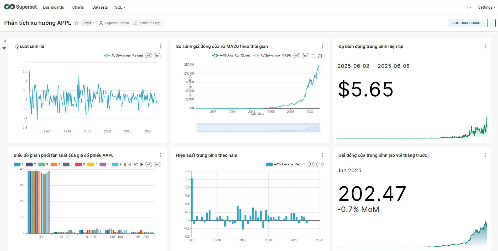

# 📊 Big Data Pipeline for Real-Time Stock Analytics

**👨‍💻 Tác giả:** Nguyễn Trung Đức  
**💻 Môi trường phát triển:** Ubuntu 24.04

## 🛠️ Công nghệ sử dụng


---

## 🚀 Giới thiệu dự án

Dự án xây dựng một hệ thống **Data Pipeline** hoàn chỉnh giúp:
- Tự động thu thập dữ liệu chứng khoán hằng ngày theo thời gian thực.
- Xử lý dữ liệu với Spark.
- Truyền tải dữ liệu qua Kafka.
- Lưu trữ và phân tích với Hadoop, PostgreSQL và Superset.

Mục tiêu là đảm bảo hệ thống **mở rộng**, **tự động hóa cao**, và **phân tích dữ liệu hiệu quả** theo chuẩn Big Data hiện đại.

---

## 🧱 Thành phần kiến trúc chính

| Thành phần         | Vai trò                                                                 |
|--------------------|-------------------------------------------------------------------------|
| **Kafka**          | Giao tiếp streaming, truyền tải dữ liệu theo thời gian thực.            |
| **PySpark**        | Xử lý dữ liệu phân tán tốc độ cao.                                      |
| **Hadoop HDFS**    | Lưu trữ dữ liệu lớn theo dạng phân tán.                                 |
| **Airflow**        | Orchestration và lập lịch thực thi các tác vụ ETL.                      |
| **PostgreSQL**     | Cơ sở dữ liệu lưu trữ dữ liệu mart, dùng cho phân tích và báo cáo.      |
| **Superset**       | Công cụ trực quan hóa dữ liệu mạnh mẽ, kết nối PostgreSQL để tạo Dashboard. |
| **Docker**         | Đóng gói toàn bộ hệ thống trong container nhất quán, dễ triển khai.     |

---

## 📁 Cấu trúc thư mục

---

## 🖼️ Kiến trúc hệ thống Pipeline


Luồng dữ liệu như sau:

1. **Extract**: Tải dữ liệu chứng khoán qua `yfinance`.
2. **Transform**: Làm sạch & xử lý qua các tầng Staging → Core → Business → Mart.
3. **Load**:
   - Lưu bản Parquet.
   - Gửi bản Business vào Kafka topic.
   - Đẩy bản Mart vào PostgreSQL.
4. **Visualize**: Truy cập từ Superset để phân tích/giám sát.

---

## 📊 Trực quan hóa với Apache Superset

- **Nguồn dữ liệu**: kết nối trực tiếp với PostgreSQL chứa dữ liệu mart.
- **Dashboard**: dễ dàng tạo biểu đồ xu hướng chứng khoán, khối lượng giao dịch theo tháng, v.v.
- **Phân quyền**: tích hợp người dùng xem dashboard theo role.

---

## ⚙️ Hướng dẫn sử dụng

### 1. 🐳 Khởi động môi trường

```bash
docker compose up --build
```

## Kết quả


- 📈 Giá hiện tại: 0.26
- 📈 Dự đoán giá tháng tới: 0.26
- 📊 Tăng/Giảm: +0.38% so với tháng hiện tại
